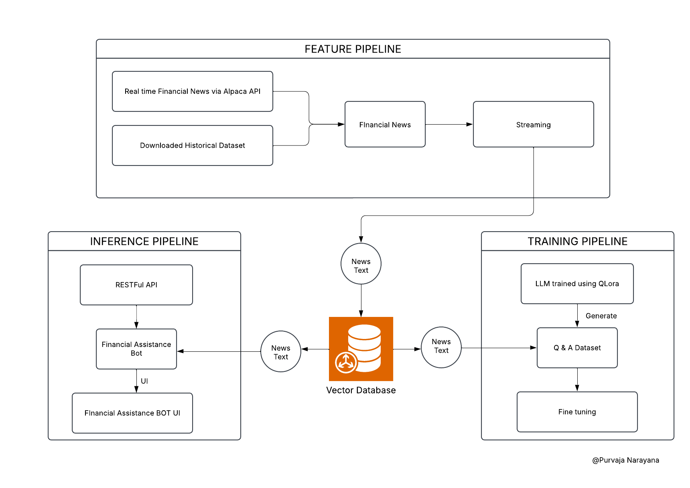

# Real-Time Financial Advisor LLM System

## Overview
The **Real-Time Financial Advisor LLM System** is an open-source AI-powered Q&A system built using GPT-3.5. It provides real-time answers and insights to financial queries, assisting investors, financial analysts, and enthusiasts with on-the-spot analysis and recommendations based on live data.

## Technology Stack
The system is built using:
- **GPT-3.5** for natural language processing and financial query answering.
- **Comet ML** for tracking experiments and fine-tuning the model.
- **ByteWax** for streaming live financial data.
- **LangChain** for developing natural language processing pipelines.
- **Vector Databases** for efficient data retrieval and analysis.

## System Architecture
The system integrates a three-pipeline architecture for real-time financial data processing:

### 1. Feature Pipeline
- Collects real-time financial news using **Alpaca API**.
- Stores historical financial datasets for analysis.
- Provides both streaming and structured financial news data.

### 2. Training Pipeline
- Uses **QLora** for training a Large Language Model (LLM) with financial data.
- Includes a **Q&A dataset** tailored for financial analysis.
- Fine-tunes the model to enhance accuracy and relevancy.

### 3. Inference Pipeline
- Exposes a **RESTful API** for external integrations.
- Features a **Financial Assistance Bot** to process user queries.
- Includes a **UI for interaction** with the financial advisory system.

### System Diagram


## Key Challenges Overcome
- **Balancing real-time performance and accuracy**: Optimized model responses to ensure rapid yet accurate financial insights.
- **Handling complex financial queries**: Developed custom tokenization and fine-tuning strategies to process diverse financial topics.
- **Efficient data retrieval**: Integrated vector databases for high-speed search and retrieval of relevant financial information.

## Impact and Results
- Significantly improves decision-making speed by providing **accurate, real-time financial insights**.
- Enables dynamic responses by integrating **live financial news** with AI analysis.
- Helps users **adapt quickly to market changes**, enhancing investment strategies.

## Future Enhancements
- **Expanding data sources**: Integrate additional financial APIs for broader market coverage.
- **Advanced ML techniques**: Improve forecasting capabilities with more sophisticated models.
- **User personalization**: Develop a custom financial advisory experience based on user behavior and preferences.

## Installation & Usage
### Prerequisites
- Python 3.8+
- OpenAI API Key
- Comet ML Account (Optional for tracking)
- Alpaca API Key (For real-time financial news)

### Installation Steps
1. Clone the repository:
   ```bash
   git clone https://github.com/yourusername/real-time-financial-advisor-llm.git
   cd real-time-financial-advisor-llm
   ```
2. Install dependencies:
   ```bash
   pip install -r requirements.txt
   ```
3. Set up environment variables:
   ```bash
   export OPENAI_API_KEY='your-api-key'
   export ALPACA_API_KEY='your-alpaca-api-key'
   ```
4. Run the system:
   ```bash
   python main.py
   ```

## Contributing
Contributions are welcome! Please follow these steps:
1. Fork the repository.
2. Create a feature branch (`git checkout -b feature-branch`).
3. Commit your changes (`git commit -m 'Add new feature'`).
4. Push to your branch (`git push origin feature-branch`).
5. Open a Pull Request.

## Contact
For any questions, feel free to reach out:
- **GitHub Issues**: Open an issue in the repository.
